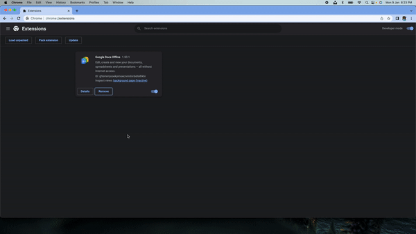

 
<h1 align="center">Tweet Mood</h1>

Tweet Mood is a Chrome Extension designed to analyse the sentiment of the tweets and display an approriate emoji amongst 😊, 😐, ☹️ beside the date of the tweet to show the mood.

<!-- TABLE OF CONTENTS -->

  
<h2 style="display: inline-block">Table of Contents</h2>

  <ol>
    <li>
      <a href="#about-the-project">About The Project</a>
      <ul>
        <li><a href="#technologies">Tech</a></li>
       <li><a href="#cloud-services">Cloud Services</a></li>
       <li><a href="#features">Features</a></li>
       <li><a href="#features">Demo</a></li>
      </ul>
    </li>
    <li><a href="#contact">Contact</a></li>
  </ol>

<!-- ABOUT THE PROJECT -->
## About The Project

### Technologies 

* [.NET](#)
* [Javascript](#)
* [YML](#)

### Cloud Services

* Azure(App Service, Language Service)
* GitHub Actions (Continuous integration & deployment)

### Features

#### General

- [x] Easy to load chrome extension
- [x] Display mood of the tweet using emoji

#### APIs

- [x] Language Detection: POST https://tweetmood.azurewebsites.net/api/language-detection
  
- [x] Sentiment Detection: POST https://tweetmood.azurewebsites.net/api/sentiment-score
  

<!-- DEMO -->
#### Demo
 

<!-- CONTACT -->
## Contact

Shreyas  - shreyasm@usc.edu
