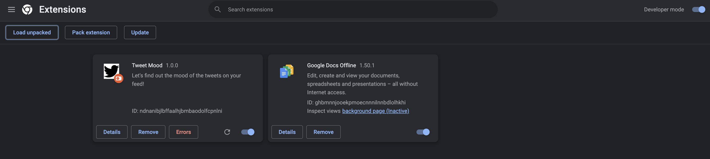

 
<h1 align="center">Tweet Mood (Hosting Deprecated)</h1>

Tweet Mood is a Chrome Extension designed to analyse the sentiment of the tweets and display an approriate emoji amongst 😊, 😐, ☹️ beside the date of the tweet to show the mood.

<!-- TABLE OF CONTENTS -->

  
<h2 style="display: inline-block">Table of Contents</h2>

  <ol>
    <li>
      <a href="#about-the-project">About The Project</a>
      <ul>
      <li><a href="#steps-to-install">Steps to install</a></li>
        <li><a href="#technologies">Tech</a></li>
       <li><a href="#cloud-services">Cloud Services</a></li>
       <li><a href="#features">Features</a></li>
       <li><a href="#demo">Demo</a></li>
      </ul>
    </li>
    <li><a href="#contact">Contact</a></li>
  </ol>

<!-- ABOUT THE PROJECT -->
## About The Project

### Steps to install
1. #### Cloning the repository: 
   - [x] Clone respository using `git clone https://github.com/staticshreyas/Tweet_Sentiment.git` 

2. #### Adding the chrome extension to chrome:
   - [x] Open chrome and go to the link `chrome://extensions/`
   - [x] Enable developer mode and click on `Load Unpacked` button as follows.
    
   - [x] Navigate and select the `Extension` folder inside the cloned repository.
    
    - [x] Extension will be loaded and running.
    

3. #### Navigate to twitter:
    
    
### Technologies

* [.NET](#)
* [Javascript](#)
* [YML](#)

### Cloud Services

* Azure(App Service, Language Service)
* GitHub Actions (Continuous integration & deployment)

### Features

#### General

- [x] Easy to load chrome extension
- [x] Display mood of the tweet using emoji

#### APIs

- [x] Language Detection: POST https://tweetmood.azurewebsites.net/api/language-detection
  
- [x] Sentiment Detection: POST https://tweetmood.azurewebsites.net/api/sentiment-score
  

<!-- DEMO -->
#### Demo

https://user-images.githubusercontent.com/50262105/236963240-1de2ba8f-5046-4007-9827-608a5abf7e2d.mov

<!-- CONTACT -->
## Contact

Email  - shreyasm@usc.edu
Phone - +1 213-913-5462
